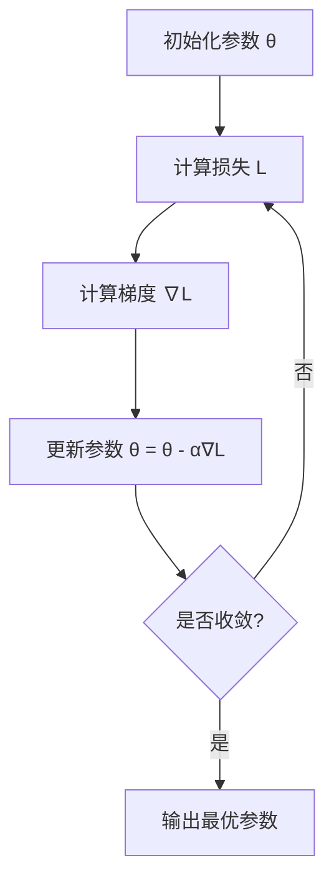

# A3 初步开发文档

项目名称：EduGraph-Agent：基于知识图谱增强 GraphRAG 的个性化学习多智能体系统

赛题来源：第十五届中国软件杯 A3 赛题《基于大模型的个性化资源生成与学习多智能体系统开发》

官网链接：https://www.cnsoftbei.com/content-3-1286-1.html

版本：v0.1

日期：2026-05-29

## 1. 项目概述

本项目面向高校专业课程学习场景，构建一个基于大模型、多智能体协作、课程知识图谱和 GraphRAG 的个性化学习系统。

系统通过自然语言对话构建动态学生画像，结合课程知识库和知识图谱分析学生的知识基础、学习目标、学习进度、易错点和学习偏好，并由多个角色智能体协作生成个性化、多模态学习资源，最终为学生规划动态学习路径、推送学习资源、提供智能辅导和学习效果评估。

项目核心目标是形成一个完整的学习闭环：

学生画像构建 -> 知识诊断 -> GraphRAG 检索 -> 多智能体资源生成 -> 学习路径规划 -> 学习效果评估 -> 画像动态更新。

## 2. 赛题理解

官网赛题要求参赛团队构建高等教育个性化学习资源体系，开发智能学习智能体系统，满足学生个性化、多模态学习需求。

根据赛题原文，系统需要重点解决以下问题：

1. 高校学习资源繁杂无序，学生难以筛选适合自己的学习材料。
2. 不同学生在知识基础、学习能力、兴趣方向上存在差异，标准化教学难以满足个性化需求。
3. 传统智能辅助系统缺乏多模态生成和多智能体协同能力。
4. 学生需要动态学习路径、精准资源推荐、即时辅导和学习效果评估。

因此，本项目不应被设计为简单的 AI 问答系统，而应被设计为一个面向高校课程的智能学习平台。

## 3. 建设目标

### 3.1 基础目标

1. 支持通过自然语言对话构建动态学生画像。
2. 学生画像包含不少于 6 个维度，并支持随学习过程持续更新。
3. 构建至少一门完整高校专业课程的初始知识库。
4. 基于课程知识库构建课程知识图谱。
5. 支持多智能体协作生成至少 5 类个性化学习资源。
6. 支持个性化学习路径规划和资源精准推送。
7. 支持现代 AI 产品交互体验，包括流式输出、Markdown 渲染、多模态内容卡片化展示。
8. 具备防幻觉、内容安全过滤、引用溯源和生成过程可解释能力。

### 3.2 增强目标

1. 支持智能辅导，提供文字解释、图解说明、代码示例和视频脚本等多种答疑形式。
2. 支持学习效果评估，包括学前测、学后测、知识点掌握度分析和错题归因。
3. 支持基于评估结果动态调整学习计划和资源推荐策略。
4. 支持多智能体运行过程可视化，便于评审理解系统内部协作机制。
5. 支持课程知识图谱可视化和学生学习路径可视化。

## 4. 用户角色

### 4.1 学生

学生是系统的主要使用者，可以完成画像构建、课程学习、资源获取、练习测试、智能问答和学习效果查看。

### 4.2 教师或课程维护者

教师负责上传课程资料、维护知识库、查看学生群体学习情况，并对生成资源进行审核或优化。

### 4.3 系统管理员

管理员负责模型配置、知识库管理、Agent 配置、权限管理、日志查看和系统维护。

## 5. 功能需求

## 5.1 对话式学生画像构建

### 功能描述

系统通过自然语言对话收集学生的专业背景、学习目标、学习历史、知识基础、学习偏好和薄弱环节，并自动抽取结构化特征，形成动态学生画像。

### 对话策略

画像构建采用"自由描述 + 结构化引导"双轨策略：

1. **自由描述优先**：系统首先邀请学生用自然语言自由描述自己的情况，Profile Agent 从中一次性抽取尽可能多的维度信息。
2. **结构化引导补全**：对话结束后，Agent 检查哪些必要维度仍缺失，针对性追问，每次只问一个方向，避免信息过载。
3. **轮数控制**：整个画像构建对话控制在 3-6 轮以内，不强制要求学生填满所有维度。
4. **实时卡片更新**：每轮对话结束后，前端画像卡片局部刷新，让学生看到系统"理解了什么"。

引导话术示例（系统开场）：

> 你好！在开始学习之前，我想先了解一下你的情况。你可以简单说说：你现在在学什么专业、想通过这门课达成什么目标，以及你觉得自己哪些基础比较薄弱？

结构化追问示例（缺失认知风格时）：

> 你更喜欢哪种学习方式？比如看图解和动画、读代码案例、做练习题，还是看文字讲解？

### 画像维度

初步设计 8 个画像维度：

1. 专业背景：专业、年级、课程基础。
2. 学习目标：考试、项目、竞赛、科研、就业等。
3. 知识基础：已掌握课程、前置知识水平。
4. 学习进度：当前所在章节、学习任务完成情况。
5. 认知风格：偏理论、偏案例、偏代码、偏图解等。
6. 易错点：历史错题、常见误解、薄弱知识点。
7. 学习偏好：文档、视频、题目、代码、项目实践等资源偏好。
8. 能力状态：编程能力、数学基础、阅读文献能力、综合应用能力。

维度优先级：

| 优先级 | 维度 | 说明 |
| --- | --- | --- |
| 必问 | 专业背景、学习目标、知识基础 | 影响路径规划和资源难度，初始对话必须覆盖 |
| 重要 | 认知风格、学习偏好 | 影响资源类型选择，缺失时结构化追问 |
| 可推断 | 易错点、能力状态 | 可从知识基础间接推断，或由后续测验结果补充 |
| 动态更新 | 学习进度 | 随学习行为自动更新，初始可为空 |

### 关键要求

1. 不使用传统长表单作为主要入口。
2. 支持从多轮对话中持续抽取画像信息。
3. 支持学习过程中根据行为数据和练习结果更新画像。
4. 画像更新应保留时间记录和依据，便于解释。
5. 画像卡片每轮对话后局部刷新，每个维度标注信息来源（来自对话第 N 轮 / 来自答题结果）。
6. 学生可在画像卡片上点击任意维度进行修正，触发针对该维度的追问。

## 5.2 课程知识库与知识图谱

### 功能描述

系统需要自行构建至少一门完整高校专业课程的初始知识库或文档集，并在此基础上构建课程知识图谱。知识图谱是 GraphRAG 检索的基础骨架，也是学习路径规划的依据。

### 推荐课程

首选课程：机器学习。

选择理由：

1. 与大模型、多智能体、知识图谱等赛题技术主题高度一致。
2. 知识点前置关系极其严格（数学基础→线性模型→优化→神经网络→深度学习），天然适合构建 PREREQUISITE 图谱。
3. 数学公式丰富，LaTeX 渲染和图解说明展示价值高；代码案例丰富（sklearn、PyTorch）。
4. 难度梯度明显（1-5 级均有），个性化路径规划效果最直观。
5. 适合展示 GraphRAG 在学习路径规划中的价值。

### 知识库内容

按优先级排列：

| 优先级 | 内容类型 | 说明 |
| --- | --- | --- |
| P0 | 章节讲义 | 每章核心概念的文字说明，是 RAG 检索的主要来源 |
| P0 | 知识点清单 | 每个知识点的名称、所属章节、难度、前置关系 |
| P0 | 习题与答案 | 用于 Exercise Agent 生成题目和 Evaluation Agent 评估 |
| P1 | 代码案例 | Python 示例代码，对应具体知识点 |
| P1 | 课程大纲 | 章节结构，用于构建图谱骨架 |
| P2 | 拓展阅读 | 参考资料链接和摘要 |

### 知识图谱节点

共 7 类节点（前置知识不单独建节点，用 PREREQUISITE 关系表达）：

| 节点类型 | 关键字段 | 说明 |
| --- | --- | --- |
| Course | course_id, name, description | 课程根节点 |
| Chapter | chapter_id, course_id, title, order | 章节节点 |
| KnowledgePoint | node_id, chapter_id, name, difficulty(1-5), estimated_minutes, summary, keywords | 图谱核心节点 |
| Resource | resource_id, type, title, content, generated_by, quality_score | 生成资源节点 |
| Exercise | exercise_id, type, question, answer, difficulty, related_node_id | 题目节点 |
| CodeCase | case_id, title, language, code, explanation, related_node_id | 代码案例节点 |
| LearningOutcome | outcome_id, description, related_node_ids | 能力目标节点 |

### 知识图谱关系

| 关系类型 | 起点 → 终点 | 说明 |
| --- | --- | --- |
| CONTAINS | Course→Chapter, Chapter→KnowledgePoint | 层级包含，有方向 |
| PREREQUISITE | KnowledgePoint→KnowledgePoint | 先修关系，有方向，是路径规划的核心依据 |
| RELATED | KnowledgePoint↔KnowledgePoint | 语义关联，无方向 |
| SUPPORTS | Resource→KnowledgePoint | 资源支撑知识点 |
| ASSESSES | Exercise→KnowledgePoint | 题目测评知识点 |
| PRACTICES | CodeCase→KnowledgePoint | 代码案例对应知识点 |
| ACHIEVES | KnowledgePoint→LearningOutcome | 知识点达成能力目标 |

### 知识图谱构建方式

采用"手工骨架 + 半自动挂载"策略，不做全自动实体抽取（质量不可控）：

**第一步：手工定义图谱骨架**

手工标注所有知识点节点和 PREREQUISITE 关系（约 50-80 个节点），存储为 `data/knowledge_graph.json`。RELATED 关系由 LLM 辅助生成后人工审核。

**第二步：文档分块与节点挂载**

课程文档按 500 token 分块，通过关键词匹配（初筛）+ LLM 判断（二次确认）将文档块挂载到对应知识点节点，建立 SUPPORTS 关系。每个文档块保存 chunk_id、source_file、content、related_node_ids 等元数据。

**第三步：向量化**

- 文档块 → Chroma（用于语义检索）
- 知识点节点描述 → 独立 Chroma collection（用于节点定位）
- Embedding 模型：BAAI/bge-large-zh-v1.5（中文效果好，本地可运行）

**存储方案**

初期使用 JSON 文件 + NetworkX，不依赖 Neo4j，降低部署复杂度。6-15 之后如时间允许再接 Neo4j。

### 机器学习知识点样例（初始图谱，约 25 个节点）

```
第1章 数学基础
  └─ 线性代数基础（difficulty: 2）
  └─ 概率论与统计基础（difficulty: 2）
  └─ 微积分与优化基础（difficulty: 2）

第2章 机器学习基础
  └─ 监督学习 vs 无监督学习（difficulty: 1，前置：概率论与统计基础）
  └─ 偏差与方差（difficulty: 2，前置：监督学习 vs 无监督学习）
  └─ 过拟合与正则化（difficulty: 3，前置：偏差与方差）
  └─ 交叉验证（difficulty: 2，前置：偏差与方差）

第3章 线性模型
  └─ 线性回归（difficulty: 2，前置：微积分与优化基础、监督学习 vs 无监督学习）
  └─ 逻辑回归（difficulty: 3，前置：线性回归、概率论与统计基础）
  └─ 梯度下降（difficulty: 3，前置：线性回归）
  └─ 随机梯度下降与 Mini-batch（difficulty: 3，前置：梯度下降）

第4章 经典算法
  └─ 决策树（difficulty: 3，前置：监督学习 vs 无监督学习）
  └─ 随机森林（difficulty: 3，前置：决策树）
  └─ SVM（difficulty: 4，前置：线性代数基础、逻辑回归）
  └─ K-Means 聚类（difficulty: 2，前置：监督学习 vs 无监督学习）
  └─ KNN（difficulty: 2，前置：监督学习 vs 无监督学习）

第5章 神经网络
  └─ 感知机（difficulty: 2，前置：线性回归）
  └─ 多层神经网络（difficulty: 3，前置：感知机）
  └─ 反向传播（difficulty: 4，前置：多层神经网络、梯度下降、微积分与优化基础）
  └─ 激活函数（difficulty: 3，前置：感知机）
  └─ Dropout 与 BatchNorm（difficulty: 3，前置：多层神经网络、过拟合与正则化）

第6章 深度学习
  └─ CNN（difficulty: 4，前置：多层神经网络）
  └─ RNN 与 LSTM（difficulty: 4，前置：多层神经网络）
  └─ Transformer 与注意力机制（difficulty: 5，前置：RNN 与 LSTM）
```

## 5.3 GraphRAG 检索增强

### 功能描述

本项目的 GraphRAG 是**图谱引导的个性化检索**，不是全自动实体抽取方案。核心公式：

> GraphRAG = 知识图谱路径扩展 + 向量检索 + 学生画像个性化过滤

三者缺一不可，这是区别于普通 RAG 的核心创新点。

### 检索流程（五步）

**第一步：节点定位**

给定学生问题，通过向量搜索节点描述 + 关键词匹配双路召回，找到最相关的 1-3 个知识点节点。

**第二步：图谱扩展**

从目标节点出发，用 NetworkX 做图遍历，扩展出子图：
- 直接前置知识（深度 1，必须包含）
- 所有祖先前置（深度 2，按需包含）
- 语义关联节点（深度 1）
- 后续知识节点（深度 1，用于学习路径推荐）

**第三步：画像个性化过滤（核心创新）**

对子图节点按学生画像进行过滤和排序：
- 跳过已掌握节点（复习模式除外）
- 过滤难度超出当前能力 +1 级的节点
- 薄弱点节点标记为高优先级
- 按学生偏好调整资源类型权重

**第四步：子图范围内向量检索**

不做全库检索，只在扩展子图对应的文档块中做向量检索，召回 top-5 相关片段。这样既保证相关性，又通过图谱约束降低幻觉风险。

**第五步：证据组装**

返回给生成 Agent 的完整上下文包含：
- 目标知识点
- 前置知识路径（如"线性回归 → 损失函数 → 梯度下降"）
- 关联知识点列表
- 检索到的文档片段（含来源文件和相关性分数）
- 个性化上下文（学生薄弱点、偏好风格、能力水平、跳过节点）

### 与普通 RAG 的对比

| 能力 | 普通 RAG | 本项目 GraphRAG |
| --- | --- | --- |
| 检索范围 | 全库向量搜索 | 图谱扩展后的子图内搜索 |
| 前置知识感知 | 无 | 自动找到前置节点链 |
| 个性化 | 无 | 按画像过滤难度、薄弱点、偏好 |
| 可解释性 | 只有相似度分数 | 返回图谱路径 + 引用来源 |
| 幻觉风险 | 较高 | 较低（检索范围受图谱约束） |

### 推荐排序因素

1. 与当前问题的语义相似度。
2. 与学生薄弱知识点的匹配度。
3. 与当前学习目标的相关性。
4. 与学生学习偏好的匹配度。
5. 知识图谱中的前置关系和难度层级。

## 5.4 多智能体协同资源生成

### 功能描述

系统需要体现多智能体架构设计，由不同角色的智能体协作完成至少 5 种类型的个性化资源生成。

### 编排模式

采用 LangGraph 状态图，主流程如下：

```
Retrieval Agent（GraphRAG 检索）
       ↓
Planning Agent（判断生成目标和资源类型）
       ↓
并行分发给 5 个资源生成 Agent
（Document / Mindmap / Exercise / Video / Code）
       ↓
Evaluation Agent（质量检查）
       ↓
Safety Agent（防幻觉过滤）
       ↓
返回前端展示
```

5 个资源生成 Agent 并行执行，互不依赖，演示时可直观体现多智能体协作效果。

### Agent 设计

| Agent 名称 | 职责 | 输入 | 输出 |
| --- | --- | --- | --- |
| Profile Agent | 构建和更新学生画像 | 学生对话、学习行为、测试结果 | 结构化学生画像 |
| Knowledge Agent | 管理课程知识图谱 | 课程文档、知识点、资源 | 知识点关系、图谱路径 |
| Retrieval Agent | 执行 GraphRAG 检索 | 学生问题、画像、知识点 | 检索证据和引用 |
| Planning Agent | 规划学习路径 | 学生画像、掌握度、课程图谱 | 个性化学习路径 |
| Document Agent | 生成讲解文档 | 检索证据、知识点、画像 | Markdown 讲解文档 |
| Mindmap Agent | 生成思维导图 | 知识点结构、章节关系 | Mermaid 思维导图 |
| Exercise Agent | 生成练习题 | 知识点、难度、学生薄弱点 | 选择题、简答题、编程题 |
| Video Agent | 生成视频或动画脚本 | 知识点、讲解文档、学生偏好 | 分镜脚本、配音文案 |
| Code Agent | 生成代码实操案例 | 知识点、课程语言、能力水平 | 示例代码、实验步骤 |
| Evaluation Agent | 评估生成质量和学习效果 | 生成资源、答题结果、反馈 | 质量评分、学习评估 |
| Safety Agent | 防幻觉与安全过滤 | 生成内容、检索证据 | 风险标记、修正建议 |

### 5 类资源详细设计

**1. Document Agent — 讲解文档**

输出为 Markdown 格式，固定结构：核心概念 → 直觉理解 → 关键公式（可选）→ 与前置知识的关系 → 引用来源。

个性化规则：
- `cognitive_style=diagram`：多用类比，少用公式
- `cognitive_style=code`：加入伪代码或 Python 片段
- `ability_math=weak`：回避复杂推导，用直觉解释替代

**2. Mindmap Agent — 思维导图**

输出 Mermaid mindmap 格式，前端直接渲染，无需额外依赖。深度控制在 3 层以内。

个性化规则：
- 薄弱点节点加 ⚠️ 标记
- 已掌握节点加 ✓ 标记

**3. Exercise Agent — 练习题**

每次生成 3-5 题，混合三种题型：

| 题型 | 说明 | 答案校验方式 |
| --- | --- | --- |
| 选择题 | 4 选 1，含解析 | 规则校验 |
| 简答题 | 开放性问答 | LLM 关键词覆盖度评分 |
| 编程题 | 含 starter_code 和参考答案 | 语法检查 + 运行结果对比（有条件时） |

个性化规则：
- `weak_points` 中的知识点多出选择题和简答题
- `cognitive_style=code` 必须包含编程题
- `ability_math=weak` 降低公式推导类题目比例

**4. Video Agent — 视频/动画脚本**

不做真实视频渲染，输出分镜脚本（JSON 格式），每个场景包含：scene_id、duration、visual（画面描述）、narration（旁白文案）、animation_hint（动画提示）。

个性化规则：
- `cognitive_style=diagram`：多用可视化场景，少用公式场景
- `cognitive_style=theory`：增加数学推导场景

**5. Code Agent — 代码实操案例**

输出完整可运行的 Python 代码 + 逐步说明 + 实验任务。代码必须通过基本语法检查后才返回。

个性化规则：
- `ability_programming=weak`：加更多注释，拆分更细的步骤
- `ability_programming=advanced`：减少注释，增加扩展挑战

### Evaluation Agent 质量检查

每个资源生成后执行三项检查：

| 检查项 | 方法 | 不通过时的处理 |
| --- | --- | --- |
| 引用一致性 | 关键事实是否能在检索证据中找到依据 | 标记风险，加免责提示 |
| 完整性 | 是否覆盖知识点核心概念 | 触发重新生成（最多 1 次） |
| 个性化匹配 | 难度和风格是否符合学生画像 | 记录偏差，不阻断流程 |

### Safety Agent 防幻觉过滤

两道防线：

1. 规则过滤：检测明显错误（公式格式错误、代码语法错误）。
2. LLM 自检：判断生成内容与检索证据的一致性，输出风险等级（low / medium / high）。

high 风险内容在前端加醒目标注，不直接屏蔽，避免影响演示流畅性。

### 资源类型

基础版本至少支持以下 5 类资源：

1. 专业课程讲解文档。
2. 知识点思维导图。
3. 不同类型练习题。
4. 多模态教学视频或动画脚本。
5. 代码类实操案例。

增强版本可增加：

1. 拓展阅读材料。
2. 实践项目学习材料。
3. 章节复习卡片。
4. 错题讲解报告。
5. 学习计划周报。

## 5.5 个性化学习路径规划

### 功能描述

系统根据学生画像、课程知识图谱和学习效果评估结果，为学生生成动态学习路径。路径不是静态列表，而是随学习行为持续调整的有向图。

### 路径生成算法

Planning Agent 基于以下规则，在知识图谱上做拓扑排序 + 优先级打分：

**第一步：确定起点**

从学生 `knowledge_base.known_topics` 出发，在图谱中标记已掌握节点，找到所有"前置已满足、本身未掌握"的节点作为候选起点。

**第二步：优先级打分**

对每个候选节点打分，分数越高越优先推荐：

| 因素 | 权重 | 说明 |
| --- | --- | --- |
| 是薄弱点 | +3 | 来自 `weak_points.self_reported` 或 `diagnosed` |
| 与学习目标相关 | +2 | 节点关键词与 `learning_goal.description` 匹配 |
| 难度匹配 | +1 / -2 | 节点难度 ≤ 能力+1 得分，超出扣分 |
| 前置完成度 | +1 | 直接前置节点已全部完成 |
| 资源偏好匹配 | +1 | 节点有符合 `preferences.resource_ranking[0]` 的资源 |

**第三步：生成路径序列**

取前 5-8 个高分节点，按拓扑顺序排列（保证前置先于后置），形成推荐学习序列。每个节点附带推荐理由（基于打分因素生成自然语言解释）。

**第四步：动态调整触发条件**

以下事件触发路径重新规划：
- 学生完成一个知识点的练习（`progress.completed_node_ids` 更新）
- 答题正确率低于 60%（触发补充前置知识）
- 学生主动跳过某节点
- 画像更新（`update_history` 新增记录）

### 路径规划规则

1. 优先补齐前置知识。
2. 优先处理高频易错知识点。
3. 学习内容难度应与学生当前能力匹配。
4. 推荐资源类型应符合学生偏好。
5. 路径应支持随学习结果动态调整。

### 学习路径数据结构

```json
{
  "path_id": "path_001",
  "student_id": "stu_001",
  "generated_at": "2026-06-01T10:00:00Z",
  "nodes": [
    {
      "node_id": "kp_linear_regression",
      "name": "线性回归",
      "status": "completed",
      "recommended_resources": ["doc_001", "exercise_003"],
      "reason": "梯度下降的直接前置知识，你已标记掌握"
    },
    {
      "node_id": "kp_gradient_descent",
      "name": "梯度下降",
      "status": "current",
      "priority": "high",
      "recommended_resources": ["doc_002", "code_001", "exercise_004"],
      "reason": "你的薄弱点，且是神经网络训练的核心基础"
    },
    {
      "node_id": "kp_backpropagation",
      "name": "反向传播",
      "status": "pending",
      "recommended_resources": [],
      "reason": "梯度下降掌握后的下一步，解决你对神经网络训练的困惑"
    }
  ],
  "update_trigger": "initial_profile"
}
```

### 学习路径展示

前端以有向图形式展示，节点状态用颜色区分：

| 状态 | 颜色 | 说明 |
| --- | --- | --- |
| completed | 绿色 | 已完成 |
| current | 蓝色高亮 | 当前学习节点 |
| weak | 橙色 | 薄弱节点，需重点关注 |
| pending | 灰色 | 待学习 |
| locked | 深灰 | 前置未完成，暂不可学 |

每个节点点击后展示：推荐理由、对应资源列表、掌握度进度条。

## 5.6 智能辅导

### 功能描述

当学生在学习过程中遇到问题时，系统提供即时答疑服务，并根据学生画像和课程知识库生成个性化解释。智能辅导不是独立问答模块，而是复用 GraphRAG 检索能力的即时响应服务。

### 触发场景

| 场景 | 触发方式 | 携带上下文 |
| --- | --- | --- |
| 学生在学习页主动提问 | 输入框发送 | 当前知识点 |
| 学生在练习题页点击"不懂这题" | 按钮触发 | 题目内容 + 学生答案 |
| 学生在资源卡片上点击"深入讲解" | 按钮触发 | 资源 ID + 知识点 |
| 学生在学习路径页点击"我不懂" | 按钮触发 | 节点 ID |

### 答疑形式

系统支持以下 6 种答疑形式，Planning Agent 根据问题类型和学生画像自动选择组合：

**1. 文字解释**

基于 GraphRAG 检索证据生成，结构：直接回答（1-2句）→ 展开解释（3-5句，引用检索证据）→ 关键词高亮（对应知识图谱节点）→ 引用来源标注。

**2. 图解说明**

用 Mermaid 图或结构化文字描述生成可视化图解：
- 概念关系图：用 Mermaid flowchart 展示知识点之间的关系
- 流程图：用 Mermaid sequenceDiagram 或 flowchart 展示算法执行过程
- 对比表格：用 Markdown 表格对比相似概念（如 BGD vs SGD vs Mini-batch）

示例（梯度下降图解）：


**3. 示例代码**

针对问题生成 10-30 行最小可运行 Python 示例，加行内注释，附"运行试试"提示。代码经语法检查后返回。

**4. 类比解释**

针对抽象概念用生活场景类比，由 LLM 生成后 Safety Agent 检查类比是否与知识点本质一致：
- 梯度下降 → "在山上找最低点，每次沿最陡方向走一步"
- 反向传播 → "考试后对答案，从结果倒推哪步出了错"
- 注意力机制 → "开会时你会重点关注和当前话题最相关的人说的话"

**5. 练习题推荐**

答疑结束后推荐 2-3 道相关练习题：同知识点不同角度、难度略低于当前题、来自已生成题库或实时生成。

**6. 视频/动画脚本片段**

针对问题生成 1-2 个场景的分镜脚本，格式与 Video Agent 一致（visual + narration + animation_hint），适合偏好视觉学习的学生。

### 答疑形式选择逻辑

Planning Agent 根据问题类型和学生画像决定本次输出哪几种形式：

| 问题类型 | 默认输出形式 |
| --- | --- |
| 概念理解（"什么是X"） | 文字解释 + 类比 + 图解说明 |
| 原理推导（"为什么X"） | 文字解释 + 图解说明 + 代码示例（可选） |
| 操作实践（"怎么用X"） | 代码示例 + 图解说明 + 练习题推荐 |
| 题目解析（"这题怎么做"） | 文字解释（解题思路）+ 图解说明 + 练习题推荐 |
| 错误纠正（"我哪里错了"） | 文字解释（错误分析）+ 类比 + 练习题推荐 |

个性化叠加规则：
- `cognitive_style=diagram`：所有类型优先加图解说明或视频脚本片段
- `cognitive_style=code`：所有类型优先加代码示例
- `ability_math=weak`：原理推导类回避公式，改用类比 + 图解
- `preferences.resource_ranking[0]=video_script`：优先输出视频脚本片段

### 题目解析专项

当触发场景为练习题时，额外输出题目解析结构：
- 错误类型标注（概念混淆 / 计算错误 / 理解偏差）
- 正确解题思路
- 关联知识点链接
- 薄弱点自动更新（答错时触发 `weak_points.diagnosed` 更新）

### 边界处理

| 情况 | 处理方式 |
| --- | --- |
| 问题超出课程范围 | 明确提示"这个问题超出了机器学习课程的范围"，不强行回答 |
| 问题太模糊 | 反问澄清，如"你是想了解梯度下降的原理，还是具体的实现方式？" |
| 检索证据不足 | 标注"以下解释基于通用知识，未找到课程内对应资料"，加风险提示 |
| 连续问同一知识点 | 第二次触发时换一种解释角度（类比→代码→图解轮换） |

### 实现要求

1. 答案必须基于课程知识库和检索证据。
2. 系统应展示引用来源或相关知识点。
3. 对超出课程范围的问题给出边界提示。
4. 对不确定内容触发防幻觉校验。
5. 支持流式输出，避免长时间等待。
6. 同一知识点被问 2 次以上，自动加入 `weak_points.diagnosed`。
7. 学生点击"我懂了"后更新 `progress.in_progress_node_ids`。

## 5.7 学习效果评估

### 功能描述

系统实时跟踪学生学习行为、练习测试情况和资源反馈，对学习效果进行多维度评估。

### 评估指标

1. 知识点掌握度。
2. 练习正确率。
3. 错题知识点分布。
4. 学习路径完成率。
5. 资源使用频率。
6. 学习时长。
7. 学前测与学后测提升。
8. 学生反馈评分。

### 输出形式

1. 学习效果报告。
2. 知识点掌握雷达图。
3. 错题归因报告。
4. 下一步学习建议。
5. 画像更新记录。

## 6. 非功能性需求

### 6.1 交互体验

**界面风格**

- 整体风格：现代教育产品风，主色调蓝色系 + 白色背景，避免过度花哨。
- 布局：左侧导航栏 + 右侧内容区，宽屏友好（1280px 以上）。
- 字体：中文用系统默认无衬线字体，代码块用等宽字体。
- 内容区留白充足，避免信息密度过高。

**流式输出**

- 所有 LLM 生成内容（辅导回答、讲解文档、练习题）均通过 SSE 流式返回。
- 前端逐字渲染，显示光标动画。
- 生成中可点击"停止生成"。

**Markdown 渲染**

- 使用 markdown-it 或 marked + highlight.js 渲染代码块。
- 支持 KaTeX 或 MathJax 渲染 LaTeX 公式。
- 支持 Mermaid 渲染思维导图和流程图，直接在页面内展示。

**多模态资源卡片化展示**

5 类资源各有独立卡片样式：

| 资源类型 | 卡片特征 |
| --- | --- |
| 讲解文档 | Markdown 渲染区 + 引用来源折叠面板 |
| 思维导图 | Mermaid 渲染区 + 全屏展开按钮 |
| 练习题 | 题目 + 选项/输入框 + 提交按钮 + 答案解析（提交后展开） |
| 视频脚本 | 分镜列表，每条含场景描述 + 旁白文案 |
| 代码案例 | 代码高亮块 + 复制按钮 + 实验任务列表 |

**生成进度追踪**

- 多 Agent 并行生成时，显示每个 Agent 的状态（等待中 / 生成中 / 已完成）。
- 用进度条或 Step 组件展示，不能只有转圈 loading。
- 每个 Agent 完成后立即展示对应资源卡片，不等全部完成再渲染。

**避免长时间白屏**

- 页面骨架屏（Skeleton）：内容加载前显示占位结构。
- 超过 3 秒未响应显示友好提示（"正在为你生成个性化内容，通常需要 10-30 秒"）。
- 异步任务后台执行，前端通过 SSE 推送状态，不阻塞页面交互。

**响应式与错误处理**

- 核心页面支持 1280px 以上宽屏，不要求移动端适配。
- API 错误时显示具体提示（"生成失败，请重试"），不显示技术报错信息。
- 网络断开时提示重连，不丢失已生成内容。

### 6.2 防幻觉与内容安全

**生成内容基于课程知识库**

- 所有生成 Agent 的 Prompt 中必须包含 GraphRAG 检索返回的证据片段。
- Prompt 明确指令：只基于提供的课程资料回答，不使用课程资料之外的知识。
- 生成结果中不允许出现检索证据中完全没有提及的核心事实断言。

**来源引用**

- 讲解文档末尾必须有"引用来源"章节，列出检索到的文档片段来源（文件名 + 章节）。
- 辅导回答中关键句子后加角标引用（如 `[1]`），底部展示来源列表。
- 引用格式：`[文件名] 第X章 第X节`。

**题目答案校验**

- 选择题：答案由 LLM 生成后，再用独立 LLM 调用验证答案是否正确。
- 简答题：关键词列表由 LLM 生成，演示场景题目需人工预先验证。
- 编程题：用 Python `ast.parse()` 做语法检查，有条件时用 `subprocess` 运行并对比输出。

**代码语法检查**

- 所有 Code Agent 和 Exercise Agent 生成的代码，返回前必须通过 `ast.parse()` 语法检查。
- 语法检查失败时触发重新生成（最多 2 次），仍失败则加风险标注后返回。
- 演示场景的代码案例需人工预先验证可运行。

**敏感内容过滤**

- Safety Agent 规则过滤层检测政治敏感词、歧视性内容、与课程完全无关的内容。
- 过滤后内容不返回，替换为"该内容无法生成，请换一种提问方式"。

**不确定结论提示**

- LLM 自检时输出置信度（high / medium / low）。
- low 置信度内容在前端加黄色警告标注："以下内容存在不确定性，建议参考原始教材"。
- 允许回答"这个问题在课程资料中没有明确说明"，不强行生成确定性答案。

**幻觉风险分级展示**

| 风险等级 | 前端展示 | 说明 |
| --- | --- | --- |
| low | 正常展示 | Safety Agent 判断内容与证据一致 |
| medium | 黄色边框 + 提示图标 | 部分内容未找到直接证据 |
| high | 橙色边框 + 醒目警告 | 内容与证据存在明显偏差 |

不直接屏蔽任何内容，避免影响演示流畅性，同时让评委看到系统具备风险感知能力。

### 6.3 性能要求

**流式响应**

- 智能辅导回答首字符延迟 ≤ 3 秒（从发送问题到第一个字出现）。
- 流式输出速度跟随 LLM 实际生成速度，不做额外缓冲。
- 实现方式：FastAPI `StreamingResponse` + SSE，前端 `EventSource`。

**生成进度展示**

- 5 类资源并行生成时，每个 Agent 独立显示状态。
- 状态流转：排队中 → 检索中 → 生成中（流式）→ 校验中 → 已完成。
- 单个资源生成预期时长：讲解文档 10-20s，思维导图 5-10s，练习题 8-15s，视频脚本 10-20s，代码案例 8-15s。

**异步任务**

- 5 类资源生成作为后台异步任务，通过 FastAPI `BackgroundTasks` 或 Celery 执行。
- 前端通过 SSE 长连接接收每个 Agent 的完成通知和结果，不使用轮询。

**生成结果缓存**

- 相同知识点 + 相同学生画像关键维度的生成结果缓存 24 小时。
- 缓存键：`hash(node_id + cognitive_style + ability_level + weak_points)`。
- 缓存存储：Redis（有条件）或内存字典（演示环境）。
- 缓存命中时直接返回，前端显示"来自缓存"标注。

**运行环境要求**

- 单机（8GB RAM，无 GPU）可运行完整演示流程。
- 使用云端 LLM API（讯飞星火 / DeepSeek / Qwen），不依赖本地大模型。
- Embedding 模型本地运行（BAAI/bge-large-zh-v1.5，约 1.3GB）。
- 演示知识库规模：50-100 个文档块，20-50 个知识点节点。

**响应时间目标**

| 操作 | 目标响应时间 |
| --- | --- |
| 页面切换 | < 500ms |
| 画像卡片更新 | < 1s |
| 智能辅导首字符 | < 3s |
| 单类资源生成完成 | < 30s |
| 学习路径重新规划 | < 2s |
| 知识图谱渲染 | < 1s |

### 6.4 合规要求

1. 使用开源项目、AI 工具或框架时，需要在文档中标注名称、来源和协议。
2. 使用 AI Coding 工具时，需要在提交材料中给出说明。
3. 系统应优先满足科大讯飞出题背景下对相关工具使用说明的要求。

## 7. 系统总体架构

系统采用前后端分离架构，技术组合确定为 Vue 3 + FastAPI + LangChain/LangGraph。

### 7.1 前端层

主要负责用户交互和可视化展示。

前端技术栈：Vue 3、TypeScript、Vite、Pinia、Vue Router、Element Plus 或 Ant Design Vue。

核心页面：

1. 登录与用户选择页。
2. 对话式画像构建页。
3. 学生画像面板。
4. 课程知识图谱页。
5. 个性化学习路径页。
6. 多智能体资源生成页。
7. 智能辅导页。
8. 练习测试页。
9. 学习效果评估页。
10. 系统管理页。

### 7.1.1 页面清单与优先级

按照比赛演示闭环，页面分为 P0 / P1 / P2 三个层级：

| 页面 | 优先级 | 作用 |
| --- | --- | --- |
| 登录与用户选择页 | P2 | 非核心，可简化为默认学生入口 |
| 对话式画像构建页 | P0 | 闭环起点，完成学生画像初始化 |
| 学生画像面板 | P0 | 展示 8 维画像、更新记录和来源 |
| 课程知识图谱页 | P1 | 展示知识点结构、前置路径和 GraphRAG 子图 |
| 个性化学习路径页 | P0 | 展示推荐学习顺序、状态和原因 |
| 多智能体资源生成页 | P0 | 展示 5 类资源生成和 Agent 进度 |
| 智能辅导页 | P1 | 提供即时答疑和多样化解答 |
| 练习测试页 | P0 | 提交答案、展示解析、触发评估 |
| 学习效果评估页 | P1 | 展示掌握度、错题归因和雷达图 |
| 系统管理页 | P2 | 管理模型配置、知识库、日志 |

### 7.1.2 各页面详细说明

#### 1. 登录与用户选择页（P2）

**目标**：非核心页面，可在比赛版本中弱化，主要用于进入演示学生样例。

**核心模块**：
- 演示学生卡片列表
- "进入系统"按钮
- 系统简介卡片

**关键交互**：
- 选择预设学生样例
- 直接进入画像构建页或学习首页

**接口依赖**：
- `GET /api/demo/students`

#### 2. 对话式画像构建页（P0）

**目标**：通过对话完成学生初始画像构建。

**核心模块**：
- 对话消息区
- 输入框和发送按钮
- 实时画像卡片侧栏
- 缺失维度提示区

**关键交互**：
- 学生自由描述 + 系统结构化追问
- 每轮对话后局部刷新画像卡片
- 点击画像字段触发修正
- 完成画像后进入学习路径页

**接口依赖**：
- `POST /api/profile/chat`
- `POST /api/profile/extract`
- `GET /api/profile/{student_id}`
- `PATCH /api/profile/{student_id}`

#### 3. 学生画像面板（P0）

**目标**：集中展示 8 维画像、来源、置信度和更新时间。

**核心模块**：
- 8 维画像卡片区
- 画像完整度进度条
- update_history 时间线
- 薄弱点与偏好摘要卡片

**关键交互**：
- 展开查看某维度的来源与置信度
- 点击字段进行补充修正
- 查看画像更新记录

**接口依赖**：
- `GET /api/profile/{student_id}`
- `GET /api/profile/{student_id}/history`
- `PATCH /api/profile/{student_id}`

#### 4. 课程知识图谱页（P1）

**目标**：展示机器学习课程图谱、前置关系和当前关注节点。

**核心模块**：
- 图谱可视化主画布
- 节点详情侧栏
- 前置路径展示区
- GraphRAG 子图高亮区

**关键交互**：
- 点击节点查看名称、难度、前置知识、相关资源
- 高亮当前学习节点和薄弱节点
- 查看从基础节点到目标节点的前置路径

**接口依赖**：
- `GET /api/graph/overview`
- `GET /api/graph/node/{node_id}`
- `GET /api/graph/path?from={from}&to={to}`
- `POST /api/graphrag/subgraph`

#### 5. 个性化学习路径页（P0）

**目标**：展示推荐学习序列、当前节点、推荐原因和节点状态。

**核心模块**：
- 路径有向图区
- 当前节点详情卡片
- 推荐原因列表
- 节点状态图例

**关键交互**：
- 点击节点查看推荐资源和推荐原因
- 标记节点为已完成 / 暂时跳过
- 触发路径重新规划

**接口依赖**：
- `GET /api/path/{student_id}`
- `POST /api/path/replan`
- `PATCH /api/path/node-status`

#### 6. 多智能体资源生成页（P0）

**目标**：围绕一个知识点生成 5 类个性化学习资源。

**核心模块**：
- 知识点选择区
- Agent 进度面板
- 5 类资源卡片区
- 引用来源折叠区

**关键交互**：
- 选择目标知识点并开始生成
- 实时查看各 Agent 状态
- 单独展开讲解文档、思维导图、练习题、视频脚本、代码案例
- 复制代码 / 全屏查看图解 / 查看引用

**接口依赖**：
- `POST /api/resources/generate`
- `GET /api/resources/task/{task_id}`
- `GET /api/resources/{resource_id}`
- `GET /api/resources/by-node/{node_id}`

#### 7. 智能辅导页（P1）

**目标**：提供基于 GraphRAG 的即时答疑。

**核心模块**：
- 提问区
- 辅导回答区
- 图解 / 代码 / 类比切换区
- 推荐练习区

**关键交互**：
- 输入问题并流式接收回答
- 查看图解说明、代码示例、类比解释
- 一键跳转到相关练习题

**接口依赖**：
- `POST /api/tutor/ask`
- `GET /api/tutor/history/{student_id}`
- `POST /api/tutor/feedback`

#### 8. 练习测试页（P0）

**目标**：完成题目作答、答案提交和即时解析。

**核心模块**：
- 题目列表区
- 提交区
- 解析结果区
- 错题标记区

**关键交互**：
- 作答并提交
- 查看正确答案、解析、相关知识点
- 点击"不懂这题"进入智能辅导

**接口依赖**：
- `GET /api/exercises/by-node/{node_id}`
- `POST /api/exercises/submit`
- `GET /api/exercises/result/{record_id}`

#### 9. 学习效果评估页（P1）

**目标**：展示掌握度、错题分布、学习报告和画像联动结果。

**核心模块**：
- 知识点掌握度雷达图
- 错题归因报告
- 学习路径完成率卡片
- update_history 联动记录区

**关键交互**：
- 查看掌握度变化趋势
- 查看错题知识点分布
- 查看评估后给出的下一步建议

**接口依赖**：
- `GET /api/evaluation/{student_id}/overview`
- `GET /api/evaluation/{student_id}/mastery`
- `GET /api/evaluation/{student_id}/report`

#### 10. 系统管理页（P2）

**目标**：便于本地调试和演示准备，不属于比赛核心流程。

**核心模块**：
- 模型配置区
- 知识库导入区
- 图谱数据管理区
- 日志查看区

**关键交互**：
- 切换模型配置
- 导入知识库样例
- 查看 Agent 执行日志

**接口依赖**：
- `GET /api/admin/config`
- `POST /api/admin/config`
- `POST /api/admin/knowledge/import`
- `GET /api/admin/logs`

### 7.1.3 演示主线对应页面顺序

比赛 7 分钟演示建议按以下页面顺序切换：

1. 对话式画像构建页
2. 学生画像面板
3. 课程知识图谱页
4. 个性化学习路径页
5. 多智能体资源生成页
6. 练习测试页
7. 学习效果评估页
8. 返回学习路径页展示更新结果

该顺序完整覆盖：画像构建 → 图谱定位 → GraphRAG 检索 → 资源生成 → 练习 → 评估 → 路径更新。

### 7.2 服务层

主要负责业务逻辑和 Agent 调度。

服务层技术栈：FastAPI、Pydantic、SQLAlchemy/SQLModel、SSE/WebSocket、异步任务队列。

核心服务：

1. 用户服务。
2. 学生画像服务。
3. 课程知识库服务。
4. 知识图谱服务。
5. 向量检索服务。
6. 多智能体编排服务。
7. 资源生成服务。
8. 学习路径规划服务。
9. 学习评估服务。
10. 内容安全服务。

### 7.3 AI 能力层

主要负责大模型调用、检索增强、生成和评估。

AI 能力层技术栈：LangChain、LangGraph、Embedding 模型、向量数据库、图数据库和大模型 API。

核心能力：

1. 大模型文本生成。
2. Embedding 向量化。
3. GraphRAG 检索。
4. 多智能体任务编排。
5. 多模态内容生成。
6. AI 辅助编程。
7. 生成内容质量评估。

### 7.4 数据层

主要负责结构化数据、向量数据和图数据存储。

数据存储：

1. 关系型数据库：用户、课程、画像、任务、资源、测评记录。
2. 向量数据库：课程文档切片、资源片段、问答记录。
3. 图数据库：课程知识图谱、知识点关系、学习路径。
4. 文件存储：PPT、Markdown、图片、视频脚本、代码文件。

## 8. 推荐技术栈

### 8.1 前端

前端确定使用 Vue 技术栈。

1. Vue 3。
2. TypeScript。
3. Vite。
4. Pinia 用于前端状态管理。
5. Vue Router 用于页面路由。
6. Element Plus 或 Ant Design Vue 用于基础组件。
7. ECharts 或 AntV G6 用于知识图谱、学习路径和学习效果可视化。
8. Markdown 渲染组件用于展示大模型生成内容。
9. SSE 或 WebSocket 支持流式输出和 Agent 运行状态展示。

### 8.2 后端

后端确定使用 FastAPI 技术栈。

1. Python 3.11+。
2. FastAPI 作为 Web 服务框架。
3. Uvicorn 作为 ASGI 服务。
4. Pydantic 用于请求、响应和配置数据校验。
5. SQLAlchemy 或 SQLModel 用于关系型数据库访问。
6. Celery、RQ 或 FastAPI BackgroundTasks 用于异步资源生成任务。
7. 后端提供 REST API、SSE 流式接口和必要的 WebSocket 接口。

### 8.3 数据库

1. PostgreSQL 或 MySQL：业务数据。
2. Neo4j：课程知识图谱。
3. FAISS、Chroma 或 Milvus：向量检索。
4. Redis：缓存和异步任务状态。

### 8.4 AI 与 Agent

Agent 确定使用 LangChain 和 LangGraph。

1. LangChain 用于模型调用、Prompt 模板、工具封装、文档加载、向量检索和 RAG 链路。
2. LangGraph 用于多智能体状态流编排，管理画像构建、检索、规划、生成、评估和安全过滤等节点。
3. 大模型：讯飞星火、Qwen、DeepSeek 或其他可用模型。
4. 文档解析：PDF、Markdown、PPT、TXT 解析工具。
5. Embedding：中文语义向量模型。
6. 安全校验：规则过滤 + 大模型评估 + 引用一致性检查。

## 9. 核心业务流程

### 9.1 首次使用流程

1. 学生进入系统。
2. 系统通过对话询问学习目标、课程基础和学习偏好。
3. Profile Agent 抽取学生画像。
4. 系统生成初始画像卡片。
5. 学生确认或修改画像。
6. Planning Agent 基于画像和课程图谱生成初始学习路径。
7. 系统推送第一批学习资源。

### 9.2 个性化资源生成流程

1. 学生选择知识点或提出学习需求。
2. Retrieval Agent 执行 GraphRAG 检索。
3. Knowledge Agent 返回知识点关系和前置路径。
4. Planning Agent 判断资源生成目标。
5. 多个资源生成 Agent 并行或串行生成内容。
6. Evaluation Agent 检查生成质量。
7. Safety Agent 执行防幻觉和内容安全过滤。
8. 系统以卡片形式展示生成资源。

### 9.3 学习路径更新流程

1. 学生完成学习任务或练习。
2. 系统记录答题结果和行为数据。
3. Evaluation Agent 计算学习效果。
4. Profile Agent 更新学生画像。
5. Planning Agent 调整后续学习路径。
6. 系统推送新的学习资源。

## 10. 初步数据模型

### 10.1 StudentProfile

完整字段定义如下，每个维度均包含来源和置信度字段，支持可解释性展示。

| 字段 | 类型 | 说明 |
| --- | --- | --- |
| student_id | string (UUID) | 学生唯一标识 |
| created_at | datetime | 画像创建时间 |
| updated_at | datetime | 最近更新时间 |
| completeness | float (0-1) | 画像完整度，用于判断是否需要继续追问 |
| background | object | 专业背景 |
| learning_goal | object | 学习目标 |
| knowledge_base | object | 知识基础 |
| progress | object | 学习进度（随行为自动更新，初始为空） |
| cognitive_style | object | 认知风格 |
| weak_points | object | 薄弱知识点（分自述和系统诊断两类） |
| preferences | object | 学习偏好 |
| ability_state | object | 能力状态 |
| update_history | array | 画像更新记录，每条记录含时间戳、触发原因和更新字段 |

**background 字段**

| 子字段 | 类型 | 说明 |
| --- | --- | --- |
| major | string | 专业名称 |
| grade | int | 年级（本科 1-4，研究生 1-3） |
| school_type | enum | undergraduate / postgraduate |
| course_foundation | array[string] | 已修课程列表 |
| source | string | 信息来源，如 dialogue_round_1 |
| confidence | float | 置信度 0-1 |

**learning_goal 字段**

| 子字段 | 类型 | 说明 |
| --- | --- | --- |
| goal_type | array[enum] | exam / course_project / competition / research / employment / interest |
| description | string | 学生自述目标原文 |
| target_course | string | 目标课程 ID |
| source | string | 信息来源 |
| confidence | float | 置信度 |

**knowledge_base 字段**

| 子字段 | 类型 | 说明 |
| --- | --- | --- |
| known_topics | array[object] | 已掌握主题，每项含 topic 和 level（weak/basic/intermediate/advanced） |
| unknown_topics | array[string] | 明确不了解的主题 |
| source | string | 信息来源 |
| confidence | float | 置信度 |

**progress 字段**

| 子字段 | 类型 | 说明 |
| --- | --- | --- |
| current_chapter_id | string / null | 当前所在章节 |
| completed_node_ids | array[string] | 已完成知识点 ID 列表 |
| in_progress_node_ids | array[string] | 进行中知识点 ID 列表 |
| completion_rate | float | 课程整体完成率 |

**cognitive_style 字段**

| 子字段 | 类型 | 说明 |
| --- | --- | --- |
| primary | enum | 主要风格：theory / case / code / diagram |
| secondary | enum | 次要风格 |
| style_ranking | array[enum] | 完整偏好排序 |
| source | string | 信息来源 |
| confidence | float | 置信度 |

**weak_points 字段**

| 子字段 | 类型 | 说明 |
| --- | --- | --- |
| self_reported | array[object] | 学生自述薄弱点，每项含 topic、node_id（可为空）、description |
| diagnosed | array[object] | 系统通过答题结果诊断的薄弱点，每项含 node_id、error_rate、last_updated |
| source | string | 信息来源 |
| confidence | float | 置信度 |

**preferences 字段**

| 子字段 | 类型 | 说明 |
| --- | --- | --- |
| resource_ranking | array[enum] | 资源类型偏好排序：document / diagram / exercise / video_script / code_case |
| session_length | enum | 单次学习时长偏好：short（≤20分钟）/ medium（20-45分钟）/ long（>45分钟） |
| difficulty_preference | enum | 难度偏好：gradual（循序渐进）/ challenge（挑战）/ review（复习巩固） |
| source | string | 信息来源 |
| confidence | float | 置信度 |

**ability_state 字段**

| 子字段 | 类型 | 说明 |
| --- | --- | --- |
| programming | enum | 编程能力：weak / basic / intermediate / advanced |
| mathematics | enum | 数学基础 |
| reading_papers | enum | 文献阅读能力 |
| application | enum | 综合应用能力 |
| source | string | 信息来源（通常为 inferred_from_knowledge_base 或 test_result） |
| confidence | float | 置信度 |

**update_history 单条记录结构**

| 子字段 | 类型 | 说明 |
| --- | --- | --- |
| timestamp | datetime | 更新时间 |
| trigger | enum | 触发来源：dialogue / exercise / feedback / system |
| trigger_detail | string | 具体触发描述，如 dialogue_round_2、exercise_node_001 |
| updated_fields | array[string] | 本次更新的字段列表 |
| summary | string | 更新摘要，用于前端展示 |

### 10.2 CourseKnowledgeNode

| 字段 | 说明 |
| --- | --- |
| node_id | 知识点 ID |
| name | 知识点名称 |
| course_id | 所属课程 |
| chapter_id | 所属章节 |
| difficulty | 难度 |
| prerequisites | 前置知识 |
| outcomes | 学习目标 |
| related_resources | 相关资源 |

### 10.3 LearningResource

| 字段 | 说明 |
| --- | --- |
| resource_id | 资源 ID |
| type | 资源类型 |
| title | 标题 |
| content | 内容 |
| related_nodes | 关联知识点 |
| difficulty | 难度 |
| generated_by | 生成 Agent |
| evidence | 检索依据 |
| quality_score | 质量评分 |

### 10.4 LearningRecord

| 字段 | 说明 |
| --- | --- |
| record_id | 学习记录 ID |
| student_id | 学生 ID |
| node_id | 知识点 ID |
| action_type | 学习行为类型 |
| score | 测试得分 |
| feedback | 学生反馈 |
| timestamp | 时间 |

## 11. MVP 范围

初赛阶段建议优先完成以下功能：

1. 一门课程的知识库导入。
2. 课程知识图谱构建和展示。
3. 对话式学生画像构建。
4. GraphRAG 检索。
5. 至少 5 类资源生成。
6. 个性化学习路径规划。
7. 智能问答辅导。
8. 学习效果基础评估。
9. 防幻觉引用机制。
10. 7 分钟演示视频可完整跑通的主流程。

## 12. 冲奖增强功能

1. 多智能体运行过程可视化。
2. 学习画像动态更新可视化。
3. 知识点掌握度雷达图。
4. 错题归因与补救路径推荐。
5. 资源生成质量评分。
6. 学前测和学后测对比。
7. 教师端资源审核。
8. AI 生成内容引用溯源。
9. 课程图谱自动抽取和人工校正。
10. 学习周报自动生成。

## 13. 开发计划

### 第 1 阶段：需求与原型

时间：1 周。

任务：

1. 明确课程选择。
2. 收集课程资料。
3. 设计系统功能清单。
4. 完成低保真原型。
5. 确定技术栈。
6. 设计数据库和知识图谱结构。

### 第 2 阶段：核心后端与知识库

时间：2 周。

任务：

1. 搭建后端项目。
2. 完成课程文档解析。
3. 完成向量库构建。
4. 完成知识图谱初版。
5. 完成 GraphRAG 检索接口。
6. 完成学生画像数据结构。

### 第 3 阶段：多智能体与资源生成

时间：2 周。

任务：

1. 完成 Agent 编排框架。
2. 实现画像 Agent。
3. 实现检索 Agent。
4. 实现资源生成 Agent。
5. 实现路径规划 Agent。
6. 实现质量评估和安全过滤。

### 第 4 阶段：前端与可视化

时间：2 周。

任务：

1. 完成对话式画像页面。
2. 完成学生画像面板。
3. 完成知识图谱页面。
4. 完成学习路径页面。
5. 完成资源生成展示页面。
6. 完成学习效果评估页面。

### 第 5 阶段：联调与材料准备

时间：1 周。

任务：

1. 打通完整演示流程。
2. 准备演示数据。
3. 优化界面体验。
4. 完成开发文档。
5. 完成测试说明书。
6. 制作 PPT。
7. 录制 7 分钟以内演示视频。

## 14. 初赛提交材料规划

### 14.1 演示 PPT

建议结构：

1. 赛题理解与痛点分析。
2. 系统总体方案。
3. 技术架构。
4. 多智能体协作机制。
5. GraphRAG 与知识图谱设计。
6. 核心功能展示。
7. 创新点总结。
8. 应用价值与未来拓展。

### 14.2 项目源码

应包含：

1. 前端源码。
2. 后端源码。
3. Agent 编排代码。
4. 数据库初始化脚本。
5. 知识库样例数据。
6. 模型和 API 配置说明。
7. 启动说明。

### 14.3 演示视频

时长：7 分钟以内。

建议流程：

1. 30 秒介绍痛点和系统定位。
2. 60 秒展示对话式画像构建。
3. 60 秒展示课程知识图谱和 GraphRAG。
4. 120 秒展示多智能体生成 5 类资源。
5. 60 秒展示学习路径规划和资源推送。
6. 60 秒展示智能辅导与学习效果评估。
7. 30 秒总结创新价值。

### 14.4 配套文档

至少包含：

1. 系统开发说明书。
2. 测试说明书。
3. 用户使用手册。
4. 开源协议与第三方工具说明。
5. AI Coding 工具使用说明。

## 15. 风险与应对

| 风险 | 表现 | 应对策略 |
| --- | --- | --- |
| 功能过多导致做不完 | Agent、图谱、资源生成、评估都要做 | 先完成 MVP 闭环，再做增强功能 |
| 多智能体流于形式 | 只是多个 Prompt | 展示 Agent 输入输出、协作流程和运行日志 |
| 生成内容幻觉 | 讲解或题目出现错误 | 使用 RAG 引用、事实校验、人工样例测试 |
| 多模态资源成本高 | 视频/动画生成耗时 | 先生成脚本、分镜和关键帧说明，演示部分样例 |
| 知识库质量不足 | 检索效果差 | 选一门课程做深，人工整理核心知识点 |
| 前端展示不直观 | 评委看不出技术深度 | 做图谱、路径、Agent 过程和画像变化可视化 |
| 文档不完整 | 影响 10% 文档分 | 开发过程中同步维护文档和测试记录 |

## 16. 创新点初稿

1. 双图谱建模：课程知识图谱 + 学生画像图谱。
2. GraphRAG 个性化检索：结合知识点关系、学生掌握度和资源语义相似度。
3. 多智能体协作生成：多个角色 Agent 协同完成资源设计、生成、评估和安全过滤。
4. 动态学习画像：从自然语言、学习行为和测试结果中持续更新画像。
5. 可解释学习路径：基于知识图谱展示推荐原因和学习顺序。
6. 闭环学习优化：根据学习效果评估动态调整资源推送和学习计划。

## 17. 当前建议决策

1. 课程选择：机器学习。
2. 系统形态：Web 应用。
3. 技术路线：知识图谱 + GraphRAG + 多智能体。
4. 前端框架：Vue 3。
5. 后端框架：FastAPI。
6. Agent 框架：LangChain + LangGraph。
7. 首要目标：打通完整学习闭环，而不是追求大量孤立功能。
8. 演示重点：动态画像、多智能体生成、GraphRAG 路径推荐、学习效果评估。

## 18. 开发时间表

详细排期见 [A3_development_schedule.md](docs/project/A3_development_schedule.md)。

当前计划周期为 2026-06-01 至 2026-06-30。排期采用可调整策略：先完成 P0 闭环，再补充 P1 创新点，最后处理 P2 增强功能和提交材料。
