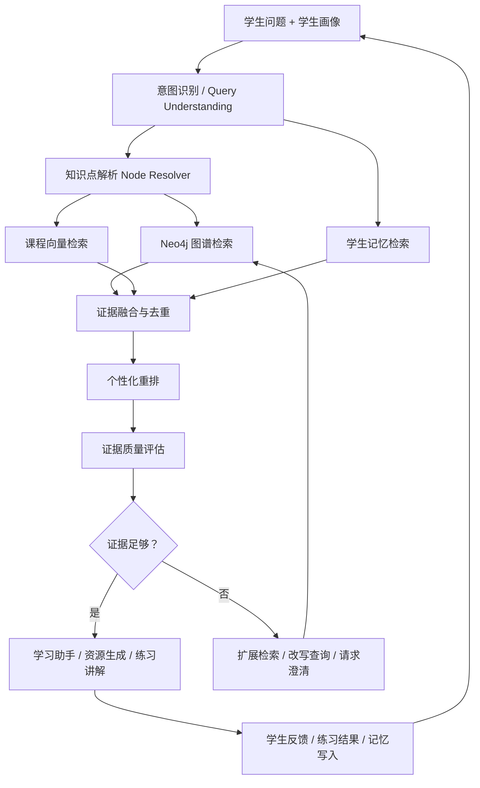

# Hybrid RAG 与 GraphRAG 融合升级方案

最后更新：2026-07-04

## 1. 文档定位

本文档专门整理当前 GraphRAG 架构的优点、缺口和升级方向。

它和两份已有文档的关系：

- `课程语义RAG建设计划.md`：聚焦课程语义索引怎么建、Chroma 存什么、如何回灌 Neo4j。
- `系统可用化审查与改造路线.md`：聚焦整个系统哪些已完成、哪些需要联调硬化。
- 本文档：聚焦 GraphRAG 如何升级为真正的 Hybrid RAG，即图谱结构检索、课程语义检索、学生记忆检索、个性化重排和证据质量评估如何融合。

核心结论：

```text
GraphRAG 不替代 Vector RAG。
GraphRAG 负责知识结构、前置路径和学习顺序。
Vector RAG 负责语义细节、段落、FAQ、代码案例和题目意图。
Memory RAG 负责学生个人历史、困惑、反馈和偏好。
最终必须经过统一融合与个性化重排，形成一个可解释 EvidencePackage。
```

## 2. 当前架构优点

### 2.1 可解释性强

当前系统能展示：

- 中心知识点。
- 前置知识。
- 相关节点。
- 多跳依赖路径。
- 练习、代码、FAQ、文档和来源。
- 缺失证据。
- `resolution_quality`。
- `suggested_alternatives`。
- `ranking_reason`。

这比单纯黑盒向量 chunks 更适合教育系统。学生和评委能看到“为什么系统推荐这个”，而不是只看到一段无法追溯的文本。

### 2.2 适合学习路径

`PREREQUISITE` 多跳关系非常适合教育场景。

普通 RAG 通常只能回答“这段资料说了什么”，但教育系统还需要回答：

- 为什么要先学这个？
- 这个知识点卡住是因为哪个前置没掌握？
- 当前问题和哪些后续知识有关？
- 学习路线应该怎么排？

Neo4j 中的知识图谱可以天然支撑这些问题。

### 2.3 能接入练习和画像闭环

当前 `EvidencePackage` 已包含 exercises，练习结果又会回写：

- `node_mastery`
- `last_practiced_at`
- 练习历史
- 错题本
- 成长时间轴

这使系统具备个性化闭环基础：

```text
证据推荐 -> 学生练习 -> 掌握度变化 -> 下一次检索和推荐改变
```

### 2.4 资源生成具备 grounding

Document、Mindmap、Exercise、CodeCase、VideoScript 都可以共享同一个 GraphRAG evidence package。

这意味着生成不是“凭空编”，而是可以围绕同一组知识点、来源、练习和误区展开。

### 2.5 能处理不确定性

当前系统已经有：

- `resolution_quality`
- `suggested_alternatives`
- `uncertainty`
- `missing_evidence`
- `evidence_completeness`
- `relevance_score`

这比很多演示系统强，因为它至少有能力承认“不确定”或“证据不足”。

## 3. 当前主要问题

### 3.1 课程文档没有真正语义召回

当前 `document_chunks` 主要通过 Neo4j 边获取，例如：

```text
(DocumentChunk)-[:SUPPORTS]->(KnowledgePoint)
```

这带来三个问题：

- 如果 chunk 没连边，永远检不到。
- 如果学生问细节，系统只能拿中心知识点下的 chunk，不能精排最相关段落。
- 文档证据相关性分数比较粗，更多依赖“是否有关联边”，而不是“是否回答了当前问题”。

例子：

```text
学生问：为什么学习率太大会让 loss 震荡？
```

当前系统可能解析到 `ml_gradient_descent`，然后拿梯度下降相关 chunk，但它不一定能优先拿到真正讲“学习率过大、震荡、收敛不稳定”的段落。

### 3.2 ranking 仍然较浅

当前排序主要使用：

- weak points
- 一些 evidence 数量统计
- 简单 profile bonus

还没有充分利用：

- `mastery`
- `preferences`
- `learning goal`
- `learning_behavior`
- recent mistakes
- forgetting curve
- exercise history
- feedback tags
- difficulty
- cognitive level

结果是系统“知道学生画像”，但画像还没有足够深地改变证据排序和回答策略。

### 3.3 GraphRAG 和 Memory RAG 没有真正融合

当前更像并行上下文拼接：

```text
retrieve_memory 单独查 Chroma
retrieve_evidence 单独查 Neo4j
prompt 时把两者一起塞进去
```

真正的融合应当是：

```text
memory -> 影响图谱扩展策略
graph nodes -> 约束课程向量召回
vector hits -> 反向补充 graph evidence
feedback behavior -> 影响 rerank
```

也就是说，记忆、图谱和向量结果不应只是并排放进 prompt，而应互相影响召回和排序。

### 3.4 证据质量评估偏规则化

当前 `evidence_score` 更多是数量型：

```text
有文档 + 有代码 + 有练习 + 有 FAQ + 有前置 = 分数更高
```

但数量不等于质量。更关键的问题是：

- 这些证据是否真的回答了当前问题？
- 是否和学生当前掌握度匹配？
- 是否有可靠来源？
- 是否能支撑资源生成？
- 如果证据不足，应该怎么补救？

### 3.5 fallback 可能误导

当前 fallback 能避免空结果，但也可能把问题带偏。

比如自然语言没匹配到明确知识点时，系统可能回退到 weak point 或搜索结果。虽然会标记 `resolution_quality=fallback`，但如果前端或助手没有明显提示，学生可能以为系统精确理解了问题。

需要明确区分：

- `exact`：精确命中，可以正常回答。
- `fallback`：近似命中，必须提示“我暂时按某知识点理解”。
- `none`：不应强答，应澄清或给候选项。

### 3.6 GraphRAG 高度依赖 Neo4j 数据完整性

FAQ、代码案例、练习、文档块如果只存在 JSON 或文件中，而没有进入 Neo4j 和向量库，就不能被真正 GraphRAG 使用。

完整数据流应是：

```text
data/faq/misconceptions.json
data/code_cases/*.py
data/exercises/*.json
data/docs/*.md
        ↓
ingestion
        ↓
Neo4j nodes + relationships
        ↓
Chroma course semantic index
        ↓
Hybrid RAG 可检索
```

## 4. 目标架构：三路召回 + 统一重排

目标形态：

```text
用户问题 + 学生画像
  -> Query Understanding
  -> Graph Retrieval: 知识点、前置、相关、习题、代码、FAQ、来源
  -> Vector Retrieval: 文档 chunk / FAQ / 代码案例 / 练习语义召回
  -> Memory Retrieval: 学生历史困惑、反馈偏好、错题和学习记忆
  -> Fusion & Rerank
  -> Evidence Quality Evaluation
  -> EvidencePackage
  -> Agent / Resource Generation
```

更完整的 `EvidencePackage` 可以逐步演化为：

```text
EvidencePackage
  graph_context
  semantic_context
  student_memory_context
  learning_state_context
  source_citations
  quality_report
  uncertainty
  recommended_actions
```

当前项目已经有雏形：

- Graph retrieval 已存在。
- Memory retrieval 已存在。
- Course semantic views 已有雏形。
- EvidencePackage 已有 `semantic_hits`。
- 质量字段已有基础版本。

最明显缺口：

- 课程语义索引还未真实构建。
- semantic hits 还未强制回灌 canonical evidence。
- 三路召回还没有统一 reranker。
- 质量评估还没有指导 repair action。

## 5. 课程向量 RAG 如何补齐

课程向量索引不应只是文档向量库，而应覆盖多类 evidence：

- `DocumentChunk`
- `Misconception`
- `CodeCase`
- `Exercise`
- `KnowledgePoint semantic view`

建议 Chroma collection：

```text
course_semantic_views
```

当前项目已使用该名称。

向量记录 metadata 建议包括：

```json
{
  "target_uid": "faq_lr_001",
  "target_type": "Misconception",
  "view_type": "student_confusion",
  "node_ids": ["ml_gradient_descent", "ml_learning_rate"],
  "chapter_id": "ch03",
  "source_uids": ["source_ml_ch03"],
  "difficulty": 3,
  "cognitive_level": "understand",
  "title": "学习率过大导致震荡",
  "tags": ["学习率", "震荡", "收敛"]
}
```

嵌入文本建议统一格式：

```text
标题：学习率过大导致震荡
类型：常见误区
知识点：梯度下降、学习率
学生可能问：为什么 loss 一直震荡？是不是学习率太大？
内容摘要：学习率过大会导致参数更新跨过最优点，使损失函数在谷底两侧来回震荡。
关键词：学习率、震荡、收敛、损失函数、梯度下降
```

检索时建议两路并行：

```text
graph-constrained semantic search:
  只在 resolved_uid、前置节点、相关节点、依赖路径节点范围内查

global semantic search:
  不限制节点，用于补救 query 解析不准或图谱边缺失
```

最终结果不直接当事实，而是：

```text
semantic hit -> target_uid -> Neo4j canonical node -> merge into EvidencePackage
```

## 6. 统一融合重排方案

建议新增或强化：

```text
backend/app/graphrag/ranking.py
backend/app/graphrag/reranker.py
```

第一版可以用规则分数，不必立刻上 cross-encoder。

建议最终分数：

```text
final_score =
  0.35 * semantic_similarity
  + 0.25 * graph_proximity
  + 0.15 * student_weak_match
  + 0.10 * mastery_need
  + 0.08 * resource_preference_match
  + 0.05 * recency_or_practice_need
  + 0.02 * source_quality
```

字段解释：

- `semantic_similarity`：向量相似度。
- `graph_proximity`：离中心知识点越近越高。
- `student_weak_match`：命中 weak_points、recent mistakes 加分。
- `mastery_need`：掌握度越低越需要基础材料。
- `resource_preference_match`：偏好代码、图解、练习时对应资源加分。
- `recency_or_practice_need`：久未复习或遗忘预警节点加分。
- `source_quality`：有来源、教材引用、可信出处加分。

每个 evidence item 都应带：

```text
final_score
score_breakdown
rank_reason
```

前端不需要展示所有数学细节，但要能展示“为什么推荐”。

## 7. 学生画像如何真正参与排序

建议扩展 `StudentProfileInput`：

```python
class StudentProfileInput(BaseModel):
    weak_points: list[str]
    preferences: list[str]
    goal: str | None
    mastery: dict[str, float]
    recent_wrong_nodes: list[str] = []
    forgotten_nodes: list[str] = []
    preferred_difficulty: str = "gradual"
    effective_formats: dict[str, float] = {}
    avoided_formats: list[str] = []
```

个性化规则：

```text
mastery < 0.3:
  优先基础文档、FAQ、低难度练习、前置知识

0.3 <= mastery < 0.7:
  优先例题、代码案例、中等练习、短测

mastery >= 0.7:
  优先综合题、对比题、项目案例、拓展节点

recent_wrong_nodes 命中:
  错题相关 FAQ、误区、同类题加权

forgotten_nodes 命中:
  复习型材料、短测、回顾总结加权

preferences 包含 code_case:
  代码案例加权

behavior 表明图解有效:
  diagram / mindmap 加权

learning_goal 指向项目实践:
  项目案例、代码案例、实践任务加权
```

这样“个性化”就不只是展示字段，而会直接改变检索和生成结果。

## 8. 证据质量评估升级

建议将质量拆成四类：

```python
class EvidenceQualityReport(BaseModel):
    coverage_score: float
    relevance_score: float
    grounding_score: float
    personal_fit_score: float
    overall_score: float
    missing_categories: list[str]
    weak_reasons: list[str]
    repair_actions: list[str]
```

计算建议：

```text
coverage_score:
  doc/code/exercise/faq/prereq/source 覆盖情况

relevance_score:
  semantic top score
  query 关键词是否出现在 title/content/keywords
  center_node 是否精确匹配
  semantic hit 是否回灌 canonical evidence

grounding_score:
  source_uids 数量
  evidence 是否有 CITES_SOURCE
  生成资源是否保留 source_uids

personal_fit_score:
  是否命中 weak_points
  是否符合 preferred resource type
  是否匹配 mastery 阶段
  是否命中 recent mistakes / forgotten nodes
```

质量评估不应只给分，还应输出修复动作：

```text
relevance_score < 0.5:
  query rewrite + global vector search

coverage_score < 0.5:
  expand prerequisites / related nodes / chapter nodes

grounding_score < 0.5:
  降低回答确定性，提示来源不足

personal_fit_score < 0.4:
  根据画像重新调整资源类型、难度和解释方式
```

这样 LangGraph 中的 `evaluate_evidence -> expand_evidence` 可以从“简单 retry”升级为“按原因修复”。

## 9. fallback 策略

建议分级：

### 9.1 exact

条件：

- 明确命中具体知识点。
- evidence 与问题相关。

行为：

- 正常回答。
- 正常生成资源。

### 9.2 fallback

条件：

- 未精确命中，但找到近似知识点。
- 或使用 weak point / broad search 兜底。

行为：

必须显式提示：

```text
我没有精确匹配到你的问题，暂时按「梯度下降」理解。
如果不是这个意思，可以选择下面的候选知识点。
```

前端应显示候选项：

- 随机梯度下降
- 学习率
- 损失函数

### 9.3 none

条件：

- 无可靠知识点。
- evidence 质量不足。

行为：

不要强行生成确定性答案。

应返回澄清问题：

```text
你想问的是：
A. 某个机器学习概念
B. 某道练习题
C. 学习路线
D. 项目应用
```

后端仍可以返回 `EvidencePackage`，但应包含：

```json
{
  "resolution_quality": "none",
  "center_node": null,
  "suggested_alternatives": [],
  "recommended_next_actions": ["请补充更具体的知识点或选择候选项"]
}
```

## 10. FAQ、代码案例、练习和文档的双索引要求

这些数据不能只放 JSON 或文件。

完整要求：

```text
Neo4j:
  保存 canonical node 和 relationships

Chroma:
  保存 semantic views / semantic entry

SQLite:
  保存学生个人行为、练习记录、反馈和资源生成记录
```

FAQ 进入 Neo4j：

```text
(:Misconception {
  uid,
  question,
  wrong_understanding,
  correction,
  explanation,
  tags
})
-[:ADDRESSES]->(:KnowledgePoint)
-[:CITES_SOURCE]->(:Source)
```

CodeCase 进入 Neo4j：

```text
(:CodeCase {
  uid,
  title,
  language,
  code,
  explanation,
  difficulty,
  runnable,
  file_path
})
-[:PRACTICES]->(:KnowledgePoint)
-[:REQUIRES]->(:KnowledgePoint)
-[:CITES_SOURCE]->(:Source)
```

Exercise 进入 Neo4j：

```text
(:Exercise {
  uid,
  title,
  type,
  difficulty,
  cognitive_level,
  question,
  answer,
  grading,
  adaptive_feedback
})
-[:ASSESSES]->(:KnowledgePoint)
-[:REQUIRES]->(:KnowledgePoint)
-[:CITES_SOURCE]->(:Source)
```

同时进入课程语义索引：

```text
FAQ embedding text:
  问题 + 错误理解 + 正确解释 + 关联知识点

CodeCase embedding text:
  标题 + 解释 + 关键代码片段 + 适用知识点

Exercise embedding text:
  题干 + 错误诊断入口 + 考察知识点 + 难度 + 反馈

DocumentChunk embedding text:
  标题 + 摘要 + 正文片段 + 关键词 + 来源
```

## 11. LangGraph 检索子图升级

当前已有节点包括：

- `retrieve_memory`
- `retrieve_evidence`
- `evaluate_evidence`
- `expand_evidence`
- `generate_resources`
- `compose_response`
- `extract_memory`

建议后续将 `retrieve_evidence` 大节点拆成更清晰的检索子图：

```text
understand_intent
  ↓
resolve_learning_target
  ↓
retrieve_graph_context
  ↓
retrieve_semantic_context
  ↓
retrieve_memory_context
  ↓
fuse_evidence
  ↓
grade_evidence
  ↓
repair_evidence?
  ↓
route_to_task_agent
```

节点职责：

```text
resolve_learning_target:
  输出 resolved_uid / candidates / resolution_quality

retrieve_graph_context:
  查 Neo4j 前置、相关、练习、代码、FAQ、来源

retrieve_semantic_context:
  查课程向量库，支持 graph-constrained + global search

retrieve_memory_context:
  查学生历史记忆、错题、反馈偏好

fuse_evidence:
  合并去重，统一排序，生成 EvidencePackage

grade_evidence:
  判断证据是否足以回答

repair_evidence:
  query rewrite / expand prereq / expand related / ask clarification
```

这会让架构从“一个 retrieve_evidence 函数做很多事”升级为可观测、可测试、可扩展的智能体检索流程。

## 12. P0：课程语义 RAG 接入 GraphRAG

目标：

解决“文档只能靠图谱边拿”的问题，让系统能根据自然语言问题语义召回具体 FAQ、文档片段、代码案例和练习。

当前状态：

- `backend/app/rag/*` 已有雏形。
- `Scripts/build_course_semantic_index.py` 已存在。
- `EvidencePackage.semantic_hits` 已存在。
- 仍需真实索引、调试接口、回灌 canonical evidence。

要做：

1. 构建真实 `course_semantic_views` Chroma 索引。
2. 新增 semantic-search 调试接口。
3. GraphRAG 中执行 graph-constrained semantic search。
4. 增加 global semantic search 作为补救。
5. `semantic_hits` 根据 `target_uid` 回查 Neo4j。
6. 合并到 `document_chunks`、`misconceptions`、`code_cases`、`exercises`。
7. Resource Agent prompt 使用回灌后的 canonical evidence。

涉及文件：

- `backend/app/rag/course_vector_store.py`
- `backend/app/rag/course_retriever.py`
- `backend/app/rag/schemas.py`
- `backend/app/graphrag/evidence_retriever.py`
- `backend/app/graphrag/schemas.py`
- `backend/app/agents/resource_agents.py`
- `Scripts/build_course_semantic_index.py`

验收：

```text
问题：学习率太大会怎样？

应命中：
- 梯度下降知识点
- 学习率相关 semantic hit
- loss 震荡相关 FAQ
- 相关文档片段
- 相关练习
- 相关代码案例
```

## 13. P1：统一融合重排

目标：

从“拿到证据”升级到“选择最适合这个学生的证据”。

要做：

1. 扩展 `StudentProfileInput`。
2. 新增 `EvidenceReranker`。
3. 引入 mastery、recent mistakes、preferences、learning_behavior、forgetting。
4. 所有 evidence item 带 `final_score` 和 `rank_reason`。
5. 前端展示“为什么推荐”。

涉及文件：

- `backend/app/graphrag/ranking.py`
- `backend/app/graphrag/schemas.py`
- `backend/app/profile/schemas.py`
- `frontend/src/components/graphrag/EvidencePanel.vue`
- `frontend/src/types/graphrag.ts`

验收：

同一个问题，不同学生画像返回不同排序：

- 喜欢代码的人先看 code_case。
- 基础薄弱的人先看前置知识和 FAQ。
- 最近错题的人先看错题相关误区和同类练习。
- 久未复习的人先看短复习和检测题。

## 14. P2：质量评估与自动修复

目标：

减少答偏、强答和证据不足。

要做：

1. 新增 `EvidenceQualityReport`。
2. `evaluate_evidence` 输出具体 `repair_actions`。
3. `repair_evidence` 按问题类型执行补救。
4. fallback / none 时前端显示候选知识点和澄清问题。
5. 低质量证据禁止强行生成确定性答案。

验收：

- 宽泛问题不会被硬塞到错误知识点。
- 证据不足时会明确说“不确定”。
- 系统会给候选项、补充问题或下一步检索建议。
- 资源生成前会检查 evidence quality，不足时先修复或提示。

## 15. 最终目标架构



一句话总结：

```text
当前系统已经有 GraphRAG 骨架，而且方向是对的。
下一步最关键不是继续堆 Agent，而是把课程语义向量检索、图谱结构检索和学生记忆检索真正融合，再用学生画像做统一重排。
这样系统才会从“能展示图谱证据的 demo”，升级为“懂知识结构、懂学生历史、能给出个性化学习支持”的真实学习系统。
```
