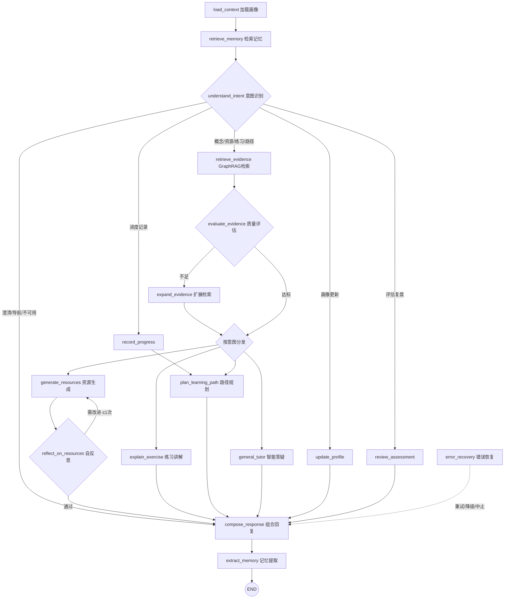
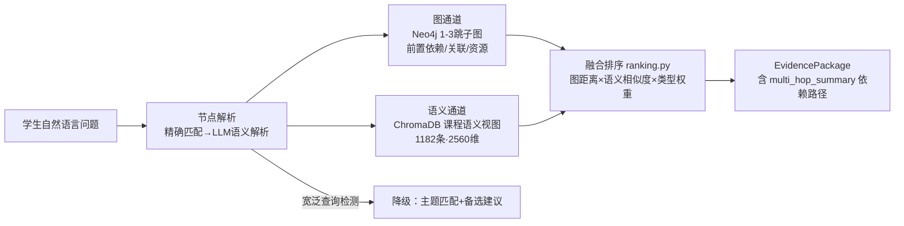

# EduGraph-Agent 系统开发说明书

版本：1.0 · 日期：2026-07-16

---

## 1. 系统概述

### 1.1 开发背景

传统在线学习平台普遍存在三大问题：内容"千人一面"、缺乏对学习者知识状态的诊断、学习资源形式单一。EduGraph-Agent 以《机器学习》课程为载体，构建"知识图谱 + 多智能体协同"的个性化学习系统，实现**诊断—讲解—练习—反馈—规划**的完整学习闭环。

### 1.2 设计目标

1. 以知识图谱为骨架组织课程知识，回答可追溯、路径可解释；
2. 以 LangGraph 多智能体编排为核心，各智能体各司其职、协同完成复杂学习任务；
3. 以多模态资源生成满足不同学习偏好（图文/导图/代码/视频脚本/图片）；
4. 以学生画像与语义记忆实现真正的个性化与持续适应。

## 2. 总体架构

```
┌─────────────────────────────────────────────────────────────────────┐
│  前端 Vue 3 + Pinia + Element Plus + ECharts（14 页面 / 20+ 组件）     │
├─────────────────────────────────────────────────────────────────────┤
│  FastAPI 后端（52 个 REST/SSE 端点，JWT 认证）                        │
│                                                                      │
│   登录/注册 → 学生画像(8维) → 知识诊断(拓扑排序) → LangGraph 编排(17节点) │
│                                                                      │
│   多智能体层：意图识别 / GraphRAG证据检索 / 资源生成(6类) / 练习辅导      │
│              学习路径 / 语义记忆 / 反馈分析 / 成长时间轴                 │
├─────────────────────────────────────────────────────────────────────┤
│  数据层： Neo4j(370节点/1067边)  SQLite(画像/对话/反馈)                │
│          ChromaDB(语义记忆+课程语义视图1182条)  文件存储(生成资产)       │
└─────────────────────────────────────────────────────────────────────┘
```

### 2.1 后端模块划分

| 模块 | 路径 | 职责 |
|------|------|------|
| 认证 | `backend/app/auth/` | 注册/登录/演示账号、JWT 双 token 轮换、bcrypt 密码哈希 |
| 学习助手 | `backend/app/assistant/` | LangGraph 17 节点编排、SSE 流式、对话持久化、反馈闭环 |
| GraphRAG | `backend/app/graphrag/` | 证据包检索、多跳依赖、质量评分、LangGraph 子图 |
| 课程语义 RAG | `backend/app/rag/` | 课程语义视图构建与向量检索（HybridRAG 的语义通道） |
| 图谱访问 | `backend/app/graph/` | Neo4j 查询、节点解析（精确+LLM 双层）、扩展策略 |
| 学生画像 | `backend/app/profile/` | 8 维画像、行为画像 EMA 更新、成长时间轴、掌握度回写 |
| 语义记忆 | `backend/app/memory/` | LLM 记忆提取、ChromaDB 向量存储、混合检索 |
| 资源生成 | `backend/app/agents/` | 6 类资源生成智能体、并发调度、LLM 自修复、知识中心 |
| 练习评估 | `backend/app/exercises/` | 练习会话、4 种模式、后端评分、错题本、复习推荐 |
| 诊断推荐 | `backend/app/diagnosis/` | 多源候选、Kahn 拓扑排序、优先级评分 |
| 图片生成 | `backend/app/image_generation/` | 讯飞 HiDream / Spark TTI 双通道文生图 |
| 基础设施 | `backend/app/core/` `app/db/` `app/api/` | 配置、日志、错误处理、服务缓存、路由汇总 |

### 2.2 前端页面

登录 / 注册 / 画像对话 / 学习助手 / 知识图谱 / 资源生成 / 知识中心 / 练习 / 练习历史 / 评估报告 / 学习路径 / 学习成长 / 画像面板 / 管理面板 共 14 个视图（`frontend/src/views/`），16 条路由（含 `/` 与 `/tutor` 两条重定向）。

### 2.3 用户界面设计

界面设计遵循"**过程可见、依据可查、行动可达**"三原则——不只给结果，还要让学生看到智能体如何工作、为什么这样回答、下一步去哪：

| 设计点 | 实现 |
|--------|------|
| 布局体系 | 侧边导航 + 主内容区；学习助手页三栏式：对话区（中）+ AgentTracePanel 智能体执行面板（右）+ EvidencePanel 证据面板（可展开），过程与结果同屏 |
| 视觉语言 | Element Plus 设计体系 + 全局 CSS 变量统一主题色；知识图谱节点按掌握状态语义着色（未学/学习中/已掌握/遗忘预警），颜色即信息 |
| 智能体过程可视化 | 17 节点执行以卡片流实时渲染（运行中/完成/待执行三态），节点名全部中文化（`core/labels.py` + 前端标签映射），内部 ID 不暴露给学生 |
| 富内容渲染 | markdown-it 管线集成 KaTeX（公式）、highlight.js（代码）、Mermaid（流程图）、markmap（可交互思维导图），机器学习内容的公式/代码/图三要素完整呈现 |
| 流式体验 | SSE 打字机输出 + 节点进度先行——答案未出时学生已能看到"正在检索证据/评估质量"，消除等待焦虑 |
| 响应式 | 1400 / 1024 / 768 三断点适配 |
| 状态反馈 | 全局 LoadingSkeleton 骨架屏、ErrorAlert 统一错误提示、空态引导（如未建画像时引导去画像对话） |

## 3. 核心技术实现

### 3.1 LangGraph 多智能体编排（17 节点）

`backend/app/assistant/graph.py` 构建 StateGraph，17 个节点：



文本视图：

```
load_context → retrieve_memory → understand_intent
  → update_profile / record_progress / retrieve_evidence / compose_response
    → evaluate_evidence → expand_evidence          # 证据质量不足时自动扩展
    → generate_resources → reflect_on_resources    # 资源生成后自反思（最多1次自动改进）
    → explain_exercise / plan_learning_path / review_assessment / general_tutor
    → compose_response → extract_memory → END
  （error_recovery：任一环节出错 → 恢复决策 retry/compose/abort）
```

关键设计：
- **条件路由**：understand_intent 输出 11 类意图标签（概念讲解/资源生成/练习辅导/路径规划/画像更新/进度记录/评估复盘/导航/闲聊/澄清/不可用），路由到不同专家智能体；置信度低时触发澄清而非硬答；
- **质量驱动**：evaluate_evidence 对证据包评分，低于阈值触发 expand_evidence 二次检索；
- **自反思**：reflect_on_resources 检查生成资源的完整性与正确性，需要改进时回流 generate_resources（限 1 次防死循环）；
- **错误恢复**：error_recovery 节点统一兜底，按恢复策略选择重试/降级组合回复/中止；
- **SSE 流式**：`run_started → node_started → trace_item → node_completed → quality_update → final_response → persisted` 事件序列，前端 AgentTracePanel 实时渲染。

### 3.2 GraphRAG / HybridRAG 证据检索

双通道混合检索（`app/graphrag/` + `app/rag/`）：



1. **图通道**：以解析出的知识点为锚点，Neo4j 中检索 1–3 跳子图（前置依赖、关联概念、练习/代码/FAQ 资源）；
2. **语义通道**：ChromaDB 课程语义视图（1182 条，2560 维）向量检索讲义片段；
3. **融合排序**：`ranking.py` 综合图距离、语义相似度、节点类型权重排序，产出 EvidencePackage（含 multi_hop_summary 依赖路径摘要）；
4. **降级策略**：宽泛查询（如"机器学习的应用"）检测 → 降级为主题匹配 + 备选建议，不硬答。

### 3.3 节点解析双层设计

`app/graph/node_resolver.py`（精确/模糊匹配：名称、别名、关键词、UID）→ 未命中时 `app/graph/llm_resolver.py`（LLM 语义解析），保证自然语言到图谱节点的高召回。

### 3.4 学生画像与行为建模

- **8 维画像**：学习目标、基础水平、学习风格、时间投入等，对话式构建（LLM 抽取 + PATCH 手动修正）；
- **node_mastery**：练习结果按知识点回写掌握度，附证据链（哪次练习、哪道题）；
- **行为画像**：8 种反馈标签 → `BehaviorProfileUpdater` EMA 增量更新（格式有效性/讲解深度/知识缺口）→ 注入后续对话 prompt；
- **成长时间轴**：全部学习事件持久化，支持日历热力图、艾宾浩斯遗忘检测、周报。

### 3.5 多模态资源生成（6 类）与自修复闭环

`app/agents/service.py` 并发调度资源生成：5 个 LangChain 资源智能体（讲解文档 / 思维导图 markmap / 练习题 / 视频脚本 / 代码案例）+ 讯飞 HiDream 文生图通道，共 **6 类资源**。

**自修复闭环（self-repair）** 是资源生成可靠性的核心——资源不是"一次生成就交付"，每类均走完整链路：

```
生成 → 校验（按类型定义标准） → 失败则把原因喂回 LLM 修复 → 再校验
  → 仍失败 → 标记失败并保留原因 → 支持单独重试该类资源
```

校验标准按资源类型定义（如讲解文档正文 ≥200 字、练习题每题必须有题干+选项+答案）；LLM 返回非严格 JSON 时由 `core/manual_json.py` 手动兜底解析。这套链路把不可控的 LLM 输出变成了工程可靠的交付。全部生成结果落库知识中心，可回看、可编辑（思维导图支持二次编辑）。

### 3.6 诊断与学习路径

`app/diagnosis/service.py`：多源候选（薄弱补强/前置补缺/目标相关/遗忘复习/错题关联）→ 依赖图 Kahn 拓扑排序 → 优先级评分 → 每个推荐节点返回 `reason / type / score / evidence`，做到**逐节点可解释**。

### 3.7 语义记忆

对话完成 → `extract_memory` 节点 LLM 抽取 MemoryEntry → ChromaDB 存储；下次对话 `retrieve_memory` 混合检索（向量相似 + 元数据过滤）注入上下文，实现跨会话记忆。

### 3.8 练习评估

`app/exercises/service.py` 的 `_grade_attempt` 按题型分发评分：选择题规则匹配、简答/案例分析走 LLM rubric 评分、编程题结构化评分（含 AST 语法检查）。评分结果按知识点回写 node_mastery（带证据链），错题按错误类型聚合（概念混淆/计算错误/记忆遗漏/应用失误）进入错题本。

## 4. 数据设计

### 4.1 Neo4j 知识图谱

- 节点：Course(1) / Chapter(11) / KnowledgePoint(50) / Entity(308)，另含 Exercise、DocumentChunk、CodeCase、FAQ、Misconception、Source；所有节点统一 `:Entity` 标签 + 唯一 `uid`；
- 关系：1067 条（HAS_CHAPTER / HAS_KNOWLEDGE_POINT / DEPENDS_ON / RELATED_TO / PRACTICES / EXPLAINS / …），定义见 `data/course/graph_edges.json` 与 `docs/knowledge-base/graph_edges_设计方案.md`；
- 导入：`Scripts/import_to_neo4j.py`（支持 --dry-run 校验、--drop-existing 重建）。

### 4.2 SQLite 业务库

users / students / profiles / conversations / messages / feedback / resource_records / node_mastery / exercise_sessions 等表，SQLAlchemy 2.0 async + aiosqlite。

### 4.3 ChromaDB 向量库

- `learning_memories`：语义记忆条目；
- 课程语义视图 collection：1182 条讲义语义切片（Qwen3-Embedding-4B，2560 维）。

### 4.4 数据集文件

| 目录 | 内容 |
|------|------|
| `data/course/` | chapters.json / knowledge_points.json / graph_edges.json / kp_llm_views.json |
| `data/docs/` | 11 章机器学习讲义 Markdown |
| `data/exercises/` | 11 章练习题 JSON + 索引 |
| `data/faq/` | 常见误区 161 条 |
| `data/code_cases/` | 代码案例 |
| `data/sources/` | 参考来源元数据 |

## 5. 接口设计

52 个 API 端点（51 个业务端点 + `/health`），按 `/api/auth`、`/api/assistant`、`/api/profile`、`/api/graph`、`/api/graphrag`、`/api/agents`、`/api/diagnosis`、`/api/exercises`、`/api/admin` 分组。完整清单（方法/路径/说明）见 `backend/README.md`。

代表性接口：

| 接口 | 说明 |
|------|------|
| `POST /api/assistant/stream` | SSE 流式对话，返回 17 节点执行事件流 |
| `POST /api/graphrag/query` | 自然语言 → EvidencePackage（含多跳依赖摘要） |
| `POST /api/agents/generate-resources` | 并发生成 6 类学习资源 |
| `POST /api/exercises/sessions/{id}/submit` | 提交答案，后端评分 + 画像回写 |
| `POST /api/diagnosis/recommend` | 拓扑排序学习路径推荐 |
| `GET /api/admin/runtime-status` | Neo4j/SQLite/LLM/Embedding/Chroma 运行状态 |

## 6. 安全设计

- JWT 双 token（access + refresh）轮换，python-jose 签发，独立 `JWT_SECRET`（非 local 环境启动强校验）；
- bcrypt 密码哈希；
- 反馈提交校验消息归属（student_id 与 message 所有者一致）防越权；
- API Key 全部走环境变量，`.gitignore` 排除 `.env`；
- LLM 不可用时返回明确 unavailable 状态，不伪装智能体输出。

## 7. 可观测性与降级

- 结构化日志（`core/logging.py`）+ 业务指标；
- `GET /api/admin/runtime-status` 一览各依赖健康状态；
- 降级链：LLM 超时 → 规则兜底；Neo4j 不可用 → 明确报错；证据不足 → 降级匹配 + 备选建议；资源生成失败 → 部分成功返回。

## 8. 开发环境与工程规范

| 项 | 值 |
|----|----|
| Python | 3.11+（开发环境 3.12） |
| Node.js | 18+ |
| 后端依赖 | `backend/requirements.txt`（FastAPI/LangGraph/LangChain/neo4j/chromadb 等 15 项） |
| 前端依赖 | `frontend/package.json`（Vue3/Vite6/Element Plus/ECharts 等） |
| 代码组织 | 后端按领域分包（models/schemas/service/repository/routes 分层）；前端 views/components/api/stores 分层 |
| 版本管理 | Git，变更历史见 git log |

团队固化了一套强制工程约定（沉淀于 `.trae/skills/edugraph/SKILL.md`，人与 AI 工具共同遵守）：

**后端约定**
- 配置只通过 `Settings` + 环境变量（`get_settings()` 统一取值），不硬编码；
- 重资源服务（Neo4j/GraphRAG/Diagnosis/Extractor）走 `ServiceCache` 单例，不重复实例化；
- 日志统一 `logging.getLogger(__name__)`，禁止 `print()`；`except Exception` 必须记日志，不允许静默吞异常；
- 生产环境 `JWT_SECRET` 必须来自环境变量；
- ORM 用 SQLAlchemy 2.0 `Mapped` 风格；新路由按"`routes/` 建文件 → `router.py` 注册 → 前端 `api/` 封装"流程。

**前端约定**
- 按功能域使用对应 Pinia store（auth / profile / assistant / learning）；
- API 统一走 `api/` 封装 + `client.ts` Axios 实例（401 自动刷新 token）；
- 类型定义放 `types/`，与后端 Schema 同步；组件按域分目录，样式用全局 CSS 变量 + `<style scoped>`。

## 9. 开发过程说明（设计 → 开发 → 测试 → 部署全流程）

项目采用 **Spec 驱动 + AI 辅助编程** 的开发流程（详见《AI_Coding工具使用说明.md》）：

1. 每个大改动先写规格：`.trae/specs/<feature>/` 下 spec.md（Why / What Changes / Impact / EARS 风格需求 + WHEN/THEN 验收场景）、tasks.md（P0/P1/P2 分级任务）、checklist.md（验收清单）三件套；
2. AI Coding 工具在 SKILL.md 工程约定的约束下按 Spec 逐任务实现；
3. 人工逐项 review diff、运行测试、按 checklist 验收。

这套"脚手架"（SKILL 规范 + spec 模板 + 目录/命名/注册约定）保证了多人 + AI 协作下代码风格一致、每个决策可解释、每次生成可修复。

全生命周期各阶段的产出与落点：

| 阶段 | 活动 | 产出（本提交包中的位置） |
|------|------|------------------------|
| 需求 | 学生学习需求研究、赛题分析、技术-需求结合点定义 | 《需求分析说明书》 |
| 设计 | 架构分层设计、17 节点编排设计、HybridRAG 融合方案、画像/图谱数据建模、UI 设计 | 本文档 §2–§4、`docs/knowledge-base/` 设计方案、`docs/project/HybridRAG与GraphRAG融合升级方案.md` |
| 数据建设 | 11 章讲义编写、50 知识点建模、1067 条关系边设计、题库/FAQ/代码案例整理 | `data/` 目录 + 导入脚本 `Scripts/import_to_neo4j.py` |
| 开发 | Spec 驱动迭代（两个大迭代：练习评估重构、系统智能化增强），AI 辅助 + 人工验收 | `.trae/specs/`、git 提交历史 |
| 测试 | 自动化冒烟（8 用例）+ 接口手工（52 端点）+ 前端功能（14 用例）+ 降级测试（5 场景） | 《测试说明书》、`backend/tests/` |
| 部署 | 本地直跑 + Docker Compose 双方案，环境变量模板化 | `提交材料/部署配置/` |
| 运维观测 | runtime-status 健康面板、结构化日志、业务指标 | 本文档 §7、`/api/admin/runtime-status` |

## 10. 创新实践

1. **图谱驱动的可解释学习智能体（GraphRAG 深度融入教学场景）**
   区别于"通用 LLM + 提示词"式学习助手：先把问题解析到课程知识图谱节点，再做 1–3 跳依赖扩展与语义检索的双通道融合。学生看到的不是一段孤立回答，而是"这个概念依赖哪些前置、证据来自哪一章讲义"。**每一条回答可追溯**，从机制上抑制幻觉，这是通用聊天 AI 无法提供的。

2. **资源生成的"生成-校验-自修复"工程化闭环**
   LLM 输出不可控是多智能体系统落地的最大障碍。本系统为 6 类资源统一建立 `生成 → 按类型校验 → 失败原因回喂 LLM 修复 → 再校验 → 仍失败则标注原因并支持单独重试` 链路，把概率性的生成变成工程上可靠的交付。

3. **编排图内嵌质量决策节点（Agentic 自反思）**
   evaluate_evidence（证据质量评分，不足自动二次扩展检索）与 reflect_on_resources（资源自检，需要时回流改进、限 1 次防死循环）作为一等节点写入 LangGraph 编排图——质量控制不是外挂的兜底代码，而是智能体决策流程本身。

4. **三闭环个性化模型**：学习闭环（对话→资源→练习→诊断→路径）、反馈闭环（8 类标签 → EMA 行为画像 → 注入后续 prompt）、记忆闭环（LLM 记忆提取 → ChromaDB → 跨会话检索注入），三环叠加让系统"越用越懂你"，且每次适应对学生可见。

5. **画像/推荐的全链路证据链**：node_mastery 更新带来源（哪次练习哪道题）、路径推荐逐节点带 reason/type/score/evidence、时间轴事件可回溯——"系统为什么这样判断"全程可查。

6. **Spec 驱动 + AI 辅助的可审计开发流程**：`.trae/specs/` 三件套 + SKILL 工程约束 + 人工 checklist 验收，AI 参与全程留痕可核查（详见《AI_Coding工具使用说明.md》），本身即是 AI 时代软件工程的一次创新实践。

## 11. 用户体验提升策略

| 策略 | 具体做法 | 解决的体验问题 |
|------|---------|---------------|
| 过程透明 | AgentTracePanel 实时渲染 17 节点执行 + SSE 打字机流式输出 | LLM 响应等待期的"黑盒焦虑"——学生始终知道系统在做什么 |
| 依据可查 | EvidencePanel 展示多跳依赖路径与讲义来源 | "AI 说的对不对？"——给学生核查的入口，建立信任 |
| 全面中文化 | 后端 `core/labels.py` + 前端标签映射，把内部节点名/枚举值/知识点 uid 全部转为中文语义标签 | 技术内部概念不泄漏给学习者 |
| 低门槛上手 | 演示账号一键登录；注册后自然语言对话即可建画像，无表单填写负担 | 首次使用的冷启动摩擦 |
| 诚实降级 | LLM 不可用返回明确 unavailable 而非伪装回答；宽泛问题给降级匹配 + 备选建议而非硬答；图片生成失败不影响其余 5 类资源 | 出错时的信任崩塌——宁可明说，不给错误答案 |
| 即时反馈成本极低 | 8 个一键反馈标签（"没看懂/太深了/例子不够"…），点一下即完成，且下次回答立刻适应 | 传统"填反馈问卷"没人填的问题 |
| 学习动机维持 | 日历热力图、成长时间轴、周报、遗忘预警 | 碎片化学习缺乏成就感与复习节奏 |
| 富媒体渲染 | 公式（KaTeX）/代码高亮/可交互导图（markmap）/流程图（Mermaid）原生渲染 | 机器学习内容"纯文本讲不清"的固有困难 |
| 容错与恢复 | error_recovery 节点统一兜底、401 自动刷新 token 不打断操作、会话历史持久化刷新不丢 | 异常场景下的挫败感 |
